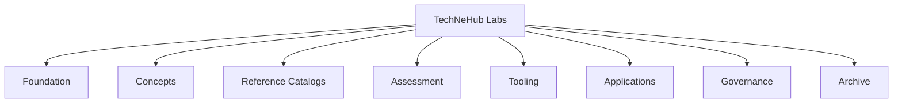
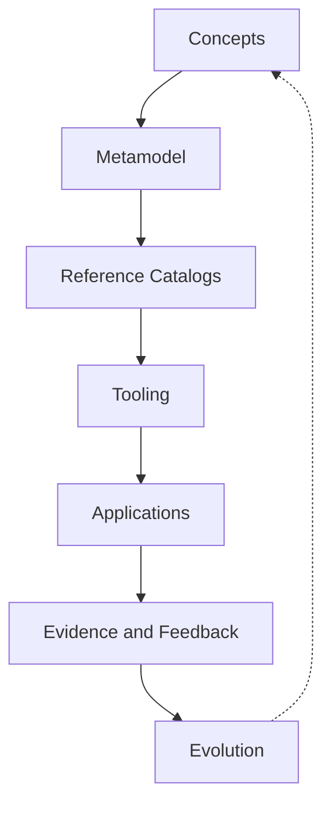

# TechNeHub Labs Portfolio

The portfolio index is the complete navigation layer for the TechNeHub Labs repository ecosystem. It sits between the organization profile and the individual repositories:

```text
Organization README      orientation: why, what, where next
        |
        v
Portfolio Index          navigation: what exists, which role, which status   (this page)
        |
        v
Repository READMEs       implementation: usage, artifacts, contribution
```

Repository tables on these pages are generated from the [portfolio registry](../registry/repositories.yaml) and validated nightly against the live organization. To change a classification, edit the registry and run `scripts/generate_portfolio.py`; do not edit generated regions directly.

---

## Portfolio Families

<!-- GENERATED:START families-table (source: registry/repositories.yaml) -->
| Family | Purpose | Repositories |
|---|---|---|
[**Foundation**](foundation.md) | Authoritative architectural, conceptual, semantic and metamodel foundations. | 6
[**Concepts**](concepts.md) | Conceptual and exploratory models representing domains, patterns and emerging areas. | 5
[**Reference Catalogs**](catalogs.md) | Governed reference catalogs instantiated from and aligned with the canonical model. | 42
[**Assessment**](assessment.md) | Assessment models, assessment mechanisms, measurement and evidence assets. | 0 (planned)
[**Tooling**](tooling.md) | Software supporting modeling, validation, generation, transformation, visualization and consumption. | 4
[**Applications**](applications.md) | Demonstrations and practical realizations of the architecture. | 0 (planned)
[**Governance**](governance.md) | Governance, lifecycle, contribution, standards and organizational assets. | 2
[**Archive**](archive.md) | Superseded, deprecated or retired repositories retained for historical purposes. | 4
<!-- GENERATED:END families-table -->

Every repository has exactly one primary family. Secondary relationships are recorded in the registry through `depends_on` metadata.

## Lifecycle

<!-- GENERATED:START lifecycle-summary (source: registry/repositories.yaml) -->
| Lifecycle | Repositories |
|---|---|
Experimental | 18
Active | 40
Stable | 1
Archived | 4
**Total** | **63**
<!-- GENERATED:END lifecycle-summary -->

Lifecycle status and portfolio family are independent properties. The lifecycle vocabulary is defined in [registry/taxonomy.md](../registry/taxonomy.md).

## Featured Repositories

Six repositories represent the strategic OpenDEAM foundations and implementation entry points:

<!-- GENERATED:START featured-list (source: registry/repositories.yaml) -->
- [Architecture Framework](https://github.com/technehub-labs/dea-architecture-framework) ([`dea-architecture-framework`](https://github.com/technehub-labs/dea-architecture-framework)): OpenDEAM : Open Digital Enterprise Architecture Model. Root authority for DEA architecture layers, building blocks, entity allocation, and relationships.
- [Concepts Model](https://github.com/technehub-labs/dea-concepts-model) ([`dea-concepts-model`](https://github.com/technehub-labs/dea-concepts-model)): OpenDEA Concepts Model : canonical conceptual layer between the DEA Metaframework (ECF) and the DEA Metamodel (CR-CM-001)
- [Metaframework](https://github.com/technehub-labs/dea-metaframework) ([`dea-metaframework`](https://github.com/technehub-labs/dea-metaframework)): Enterprise Concept Framework, the 7×7 axiom-derived matrix that the DEA metamodel and catalogs instantiate.
- [Metamodel](https://github.com/technehub-labs/dea-metamodel) ([`dea-metamodel`](https://github.com/technehub-labs/dea-metamodel)): Digital Enterprise Architecture Metamodel: canonical entity definitions, relationships, and schemas for all DEA catalog repositories.
- [Business Capability](https://github.com/technehub-labs/dea-catalog-business-capabilities) ([`dea-catalog-business-capabilities`](https://github.com/technehub-labs/dea-catalog-business-capabilities)): Business Capability, the ability to deliver value, mapped to ECF coordinates.
- [Web Viewer](https://github.com/technehub-labs/dea-web-viewer) ([`dea-web-viewer`](https://github.com/technehub-labs/dea-web-viewer)): Visual canvas and tooling for enterprise architecture modeling
<!-- GENERATED:END featured-list -->

## Portfolio Map



[Foundation](foundation.md) · [Concepts](concepts.md) · [Reference Catalogs](catalogs.md) · [Assessment](assessment.md) · [Tooling](tooling.md) · [Applications](applications.md) · [Governance](governance.md) · [Archive](archive.md)

## How Assets Flow

The repositories form an ecosystem, not a collection. Assets flow from concept to realization, and evidence flows back:



## Maintaining This Index

1. Edit the registry: [`registry/repositories.yaml`](../registry/repositories.yaml).
2. Validate: `python3 scripts/validate_registry.py --check-only`.
3. Regenerate: `python3 scripts/generate_portfolio.py`.
4. Nightly CI (`portfolio-check.yml`) validates the registry against the live organization and verifies that generated regions are current.

Classification rules and the family vocabulary are specified in [registry/taxonomy.md](../registry/taxonomy.md). The registry schema and maintenance contract are specified in [registry/README.md](../registry/README.md).
