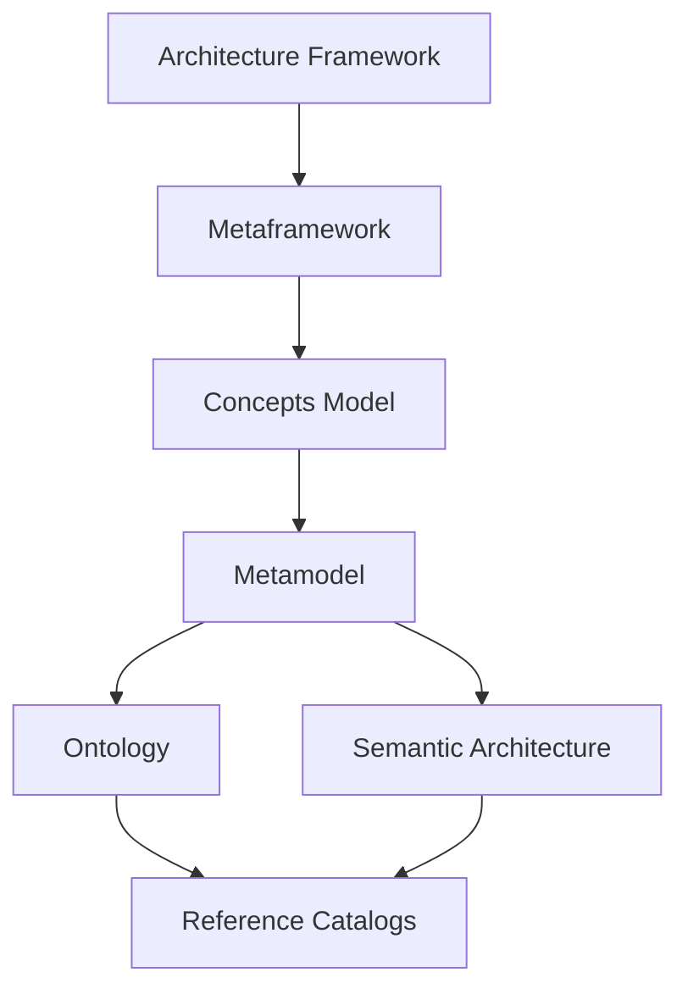

# Foundation

The authoritative architectural, conceptual, semantic and metamodel foundations of OpenDEAM. These six repositories form the dependency spine of the portfolio: every catalog, tool and application ultimately derives from them.

<!-- GENERATED:START family-table (source: registry/repositories.yaml) -->
| Asset | Repository | Status | Canonical | Description |
|---|---|---|---|---|
[Architecture Framework](https://github.com/technehub-labs/dea-architecture-framework) | [`dea-architecture-framework`](https://github.com/technehub-labs/dea-architecture-framework) | Active | Canonical | OpenDEAM : Open Digital Enterprise Architecture Model. Root authority for DEA architecture layers, building blocks, entity allocation, and relationships.
[Concepts Model](https://github.com/technehub-labs/dea-concepts-model) | [`dea-concepts-model`](https://github.com/technehub-labs/dea-concepts-model) | Active | Canonical | OpenDEA Concepts Model : canonical conceptual layer between the DEA Metaframework (ECF) and the DEA Metamodel (CR-CM-001)
[Metaframework](https://github.com/technehub-labs/dea-metaframework) | [`dea-metaframework`](https://github.com/technehub-labs/dea-metaframework) | Active | Canonical | Enterprise Concept Framework, the 7×7 axiom-derived matrix that the DEA metamodel and catalogs instantiate.
[Metamodel](https://github.com/technehub-labs/dea-metamodel) | [`dea-metamodel`](https://github.com/technehub-labs/dea-metamodel) | Stable | Canonical | Digital Enterprise Architecture Metamodel: canonical entity definitions, relationships, and schemas for all DEA catalog repositories.
[Ontology](https://github.com/technehub-labs/dea-ontology) | [`dea-ontology`](https://github.com/technehub-labs/dea-ontology) | Active | Canonical | Enterprise Ontology : canonical grounding repository for formal OWL/RDF ontology practice (upper-ontology conventions, ontology-engineering patterns, ontology lifecycle) and the means to author sector-, industry-, and sub-sector-specific Enterprise Ontologies (e.g. Enterprise Business Ontology, Enterprise Technology Ontology). (CR-EO-01)
[Semantic Architecture](https://github.com/technehub-labs/dea-semantic-architecture) | [`dea-semantic-architecture`](https://github.com/technehub-labs/dea-semantic-architecture) | Active | Canonical | Enterprise Semantic Architecture : canonical grounding repository for how enterprises organise meaning (semantic layers, vocabularies, concept graphs, knowledge-graph architectures) and the means to author sector-, industry-, and sub-sector-specific Semantic Architecture assets. (CR-ESA-01)
<!-- GENERATED:END family-table -->

---

[Portfolio Index](README.md) · [Registry](../registry/repositories.yaml) · [Organization Profile](../profile/README.md)
