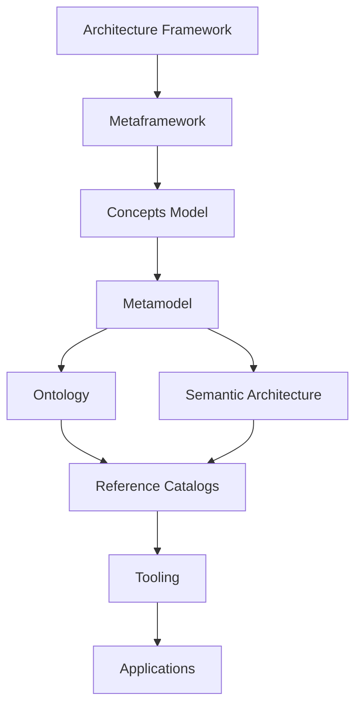

# TechNeHub Labs

> **Open Digital Enterprise Architecture Model (OpenDEAM): an open reference framework for modernizing enterprise architecture and defining a digital ecosystem enterprise architecture, targeting enterprise architects, solutions architects, and technology leaders.**

---

## TechNeHub Labs

TechNeHub Labs is a non-profit open-source initiative approaching the increasingly complex landscape of systems realization with a vendor-neutral reference framework for Digital Business Ecosystem Architecture (DBEA) and Digital Enterprise Architecture (DEA). It provides concepts with structured definitions, reusable patterns, and tooling as OpenDEAM, helping enterprise architects, information engineering architects, systems architects, information and communications technology architects, and operations architects to model, govern, and evolve enterprise business landscapes.

## OpenDEAM

OpenDEAM provides an open, model-driven foundation for representing enterprise architecture: capabilities, processes, information, technology, value, assessment, and related enterprise concerns. The work is organized as a set of independently governed but interoperable repositories.

The portfolio is arranged in repository tiers (T0 root model, T1 metamodel, T2 reference catalogs, T3 tooling, plus cross-cutting governance). These tiers are distinct from the OpenDEAM architecture layers L1 to L5, which are defined only in the [architecture framework](https://github.com/technehub-labs/dea-architecture-framework).

## Start Here

| I am interested in... | Start with |
|---|---|
| Understanding OpenDEAM | [Architecture Framework](https://github.com/technehub-labs/dea-architecture-framework) |
| The metamodel | [dea-metamodel](https://github.com/technehub-labs/dea-metamodel) |
| The conceptual foundations | [Metaframework](https://github.com/technehub-labs/dea-metaframework) and [Concepts Model](https://github.com/technehub-labs/dea-concepts-model) |
| Reference catalogs | [Catalog Index](https://github.com/technehub-labs/.github/blob/main/portfolio/catalogs.md) |
| Enterprise concepts | [Concepts](https://github.com/technehub-labs/.github/blob/main/portfolio/concepts.md) |
| Assessment | [Assessment](https://github.com/technehub-labs/.github/blob/main/portfolio/assessment.md) |
| Developer tooling | [Tooling](https://github.com/technehub-labs/.github/blob/main/portfolio/tooling.md) |
| Visual modeling | [dea-web-viewer](https://github.com/technehub-labs/dea-web-viewer) |
| Contributing | [Participate](#participate) |

## Architecture

The foundation repositories form a dependency spine; catalogs, tooling, and applications derive from it:

The defining loop this enables: **Describe, Assess, Identify Gap, Decide, Transform, Measure, Reassess**. Architecture stops being merely descriptive.

Every structural decision in the portfolio traces to a numbered Change Request in [`dea-metamodel/change-requests`](https://github.com/technehub-labs/dea-metamodel/tree/main/change-requests) and to Architecture Decision Records in the foundation repositories. Repository implementation does not itself establish normative architectural or semantic decisions.

## Explore the Portfolio

| Area | Purpose |
|---|---|
| **Foundation** | Architectural, conceptual, semantic, and metamodel foundations |
| **Concepts** | Emerging and specialized conceptual models |
| **Reference Catalogs** | 40+ governed reference catalogs derived from the canonical model |
| **Assessment** | Assessment models, mechanisms, and evidence |
| **Tooling** | Tools for modeling, validation, generation, and consumption |
| **Applications** | Demonstrations and practical realizations |
| **Governance** | Lifecycle, contribution, and governance assets |

The complete repository inventory is maintained in a dedicated portfolio index, classified by architectural role, lifecycle status, and canonical status:

**[Explore the OpenDEAM Portfolio Index](https://github.com/technehub-labs/.github/blob/main/portfolio/README.md)**

## Featured Repositories

A deliberately small set of repositories representing the principal OpenDEAM foundations and implementation entry points:

**[Architecture Framework](https://github.com/technehub-labs/dea-architecture-framework) · [Metaframework](https://github.com/technehub-labs/dea-metaframework) · [Concepts Model](https://github.com/technehub-labs/dea-concepts-model) · [Metamodel](https://github.com/technehub-labs/dea-metamodel) · [Business Capabilities](https://github.com/technehub-labs/dea-catalog-business-capabilities) · [Web Viewer](https://github.com/technehub-labs/dea-web-viewer)**

## Status

TechNeHub Labs is in **alpha**. Current versions: **OpenDEAM v0.5.0** (root model) and **dea-metamodel v1.0.0** (canonical metamodel). The metamodel and core tooling are functional; reference catalogs are being populated.

Work is tracked through GitHub Projects: [Foundation Core](https://github.com/orgs/technehub-labs/projects/3) · [Catalog Ecosystem](https://github.com/orgs/technehub-labs/projects/4) · [Developer Tooling](https://github.com/orgs/technehub-labs/projects/5) · [Web Viewer and Packaging](https://github.com/orgs/technehub-labs/projects/6) · [Governance and Standards](https://github.com/orgs/technehub-labs/projects/7).

## Participate

Contributions are welcome. Please begin with the repository-specific documentation before proposing changes.

- **Propose**: open an issue in the relevant repository.
- **Portfolio classification**: repository family, lifecycle, and featured status are governed through the [portfolio registry](https://github.com/technehub-labs/.github/blob/main/registry/repositories.yaml) and validated nightly.
- **Governance**: architectural and semantic decisions land through the change-request process, not through repository implementation.

## License

All TechNeHub Labs repositories are licensed under the Apache License 2.0 unless otherwise noted.
