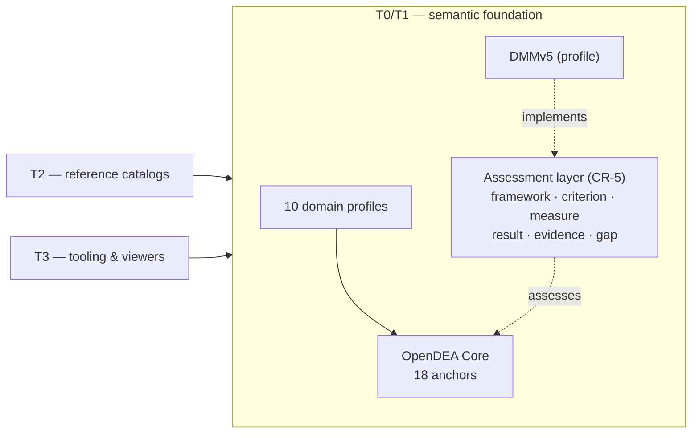

# TechNeHub Labs

> **Digital Enterprise Architecture — open reference framework for enterprise architects, solutions architects, and technology leaders.**

[](https://github.com/technehub-labs)
[](https://github.com/technehub-labs/dea-metaframework)
[](LICENSE)

---

## What is TechNeHub Labs?

TechNeHub Labs is an open-source, vendor-neutral reference framework for Digital Enterprise Architecture (DEA). It provides structured definitions, reusable patterns, and tooling to help architects model, govern, and evolve enterprise technology landscapes.

The framework is built in layers — from a shared metamodel that defines the core concepts, through curated reference catalogs, to developer tooling and governance policies.

---

## The DEA Framework

The organisation is arranged in **repository tiers** (T0–T3 — distinct from OpenDEAM
*architecture layers* L1–L5, which are defined only in `dea-architecture-framework`):

```
T0 — Root model         OpenDEAM: architecture layers L1–L5, building blocks, entity allocation, relationships
T1 — Metamodel          Machine-readable canonical schemas: JSON Schema, TTL ontology, SQLite, Pydantic, TypeScript
T2 — Reference Catalogs One repository per first-level entity (40+ catalogs) — Tenets · Guardrails · Patterns ·
                        Concepts · Blueprints · Ontologies · Metrics · and the L1–L5 entity catalogs
T3 — Tooling            CLI · Code generators · Web viewer · Scripts · Packaging
Governance (cross-cutting)  Branch strategy · Release process · SBOM · CODEOWNERS · PR templates · Apache 2.0
```

### Why the metamodel is shaped this way

Every structural decision in the DEA assets traces to a numbered Change Request in
[`dea-metamodel/change-requests/`](https://github.com/technehub-labs/dea-metamodel/tree/main/change-requests).
The programme so far, and the reasoning embedded in the repositories:

| CR | Rationale | What it produced |
|---|---|---|
| CR-001 Canonical Model | Scattered copies of the model made every consumer guess which was true. | One normative source; all schemas, DBs, graphs and docs are derived and drift-tested. |
| CR-002 Relationship Semantics | Untyped relationships made the graph ambiguous. | Typed, directed, inverse-aware relationship ontology. |
| CR-003 Normalization | Relationship state on entities always drifted. | Entities carry no relationship state; relationship instances are authoritative. |
| CR-004 Core Ontology | Frameworks (DMM, ECF, ArchiMate) were leaking into the base vocabulary. | 18-anchor Core + 10 profiles; profiles extend, never redefine. |
| CR-005 Assessment & Measurement | `capability.maturity = 3` conflates what the enterprise *is* with how it is *assessed*. | A separate assessment layer — frameworks own maturity; results carry evidence, confidence and provenance; gaps connect to Change. DMMv5 plugs in as a profile, versioned independently. |



The defining loop this enables: **Describe → Assess → Identify Gap → Decide → Transform →
Measure → Reassess** — architecture stops being merely descriptive.

### Repositories

<!-- REPO-TABLE:START — maintained manually; drift-checked nightly by .github/workflows/repo-drift-check.yml -->
<!-- Conventions: private repositories carry "🔒" in the Group cell; archived repositories carry the word "archived". -->
| Repo | Group | Description |
|------|-------|-------------|
| [`dea-architecture-framework`](https://github.com/technehub-labs/dea-architecture-framework) | Core | OpenDEAM — Open Digital Enterprise Architecture Model. Root authority for DEA architecture layers, building blocks, entity allocation, and relationships. |
| [`dea-metaframework`](https://github.com/technehub-labs/dea-metaframework) | Core | Enterprise Concept Framework — the 7×7 axiom-derived matrix that the DEA metamodel and catalogs instantiate. |
| [`dea-metamodel`](https://github.com/technehub-labs/dea-metamodel) | Core | Digital Enterprise Architecture Metamodel — canonical entity definitions, relationships, and schemas for all DEA catalog repositories. |
| [`agentic-workflows`](https://github.com/technehub-labs/agentic-workflows) | Concept 🔒 | Agent-task concept repository for the Agentic Workflows pattern — composes references, tools, and artifacts for agent roles, tools, prompts, orchestration patterns, and evaluation harnesses. |
| [`autonomous-enterprise`](https://github.com/technehub-labs/autonomous-enterprise) | Concept | Umbrella concept repository for the Autonomous Enterprise pattern — composes references, tools, and artifacts on top of the DEA catalogs and the four sibling concept repositories. |
| [`autonomous-flow`](https://github.com/technehub-labs/autonomous-flow) | Concept 🔒 | Cross-system flow concept repository for the Autonomous Flow pattern — composes references, tools, and artifacts for event streaming, data pipelines, change data capture, and event-driven integration. |
| [`autonomous-networks`](https://github.com/technehub-labs/autonomous-networks) | Concept 🔒 | Network-layer concept repository for the Autonomous Networks pattern — composes references, tools, and artifacts for intent-based networking, service mesh, zero-trust, traffic engineering, and self-healing transport. |
| [`autonomous-operations`](https://github.com/technehub-labs/autonomous-operations) | Concept 🔒 | Ops-layer concept repository for the Autonomous Operations pattern — composes references, tools, and artifacts for automating incident response, change, observability, capacity, reliability, and compliance. |
| [`agentic-enterprise-innovation`](https://github.com/technehub-labs/agentic-enterprise-innovation) | Concept — archived | AI agent-driven approaches to enterprise innovation and automation |
| [`ea-foundation`](https://github.com/technehub-labs/ea-foundation) | Concept — archived | Enterprise Architecture foundation: models, principles, and reference frameworks |
| [`ecosystem-architecture`](https://github.com/technehub-labs/ecosystem-architecture) | Concept — archived | Architecture framework for business and technology ecosystems |
| [`dea-catalog-actors`](https://github.com/technehub-labs/dea-catalog-actors) | Catalog 🔒 | Actors catalog — DEA L1 catalog repository for performers of enterprise processes (humans, teams, systems, AI agents). |
| [`dea-catalog-agent-foundry`](https://github.com/technehub-labs/dea-catalog-agent-foundry) | Catalog 🔒 | Agent Foundry — catalogue of autonomous agent patterns, agent platform specifications, multi-agent orchestration frameworks, and operational governance policies. |
| [`dea-catalog-ai-ml-models`](https://github.com/technehub-labs/dea-catalog-ai-ml-models) | Catalog | AI / ML Model — trained model that augments or automates a system function. |
| [`dea-catalog-api-contracts`](https://github.com/technehub-labs/dea-catalog-api-contracts) | Catalog | API / Service Contract — versioned contract exposing a system function. |
| [`dea-catalog-application-components`](https://github.com/technehub-labs/dea-catalog-application-components) | Catalog | Application Component — deployable unit hosting system functions. |
| [`dea-catalog-blueprints`](https://github.com/technehub-labs/dea-catalog-blueprints) | Catalog | DEA catalog: Blueprint (BLU) — composed target-state designs from Architecture Patterns. OpenDEAM v0.4.0 (ADR-0004; renamed from dea-catalog-reference-models) |
| [`dea-catalog-business-capabilities`](https://github.com/technehub-labs/dea-catalog-business-capabilities) | Catalog | Business Capability — ability to deliver value, mapped to ECF coordinates. |
| [`dea-catalog-business-objects`](https://github.com/technehub-labs/dea-catalog-business-objects) | Catalog 🔒 | L1 reference catalog for Business Objects (BO) — the atoms of the ECF matrix. Each entry is a real-world entity of interest to the business, classified by (ecf_domain, ecf_stage) coordinates plus a free-form object_class label. |
| [`dea-catalog-change-initiatives`](https://github.com/technehub-labs/dea-catalog-change-initiatives) | Catalog | A deliberate effort to shift Skills, Roles, or culture within an Organizational Unit, typically funded by an Investment Initiative. |
| [`dea-catalog-concepts`](https://github.com/technehub-labs/dea-catalog-concepts) | Catalog 🔒 | DEA catalog: Concept (CON) — semantic-dimension concept graph. OpenDEAM v0.4.0 (ADR-0004; renamed from dea-catalog-glossary, absorbs dea-catalog-taxonomy) |
| [`dea-catalog-controls`](https://github.com/technehub-labs/dea-catalog-controls) | Catalog | A mechanism (process, technical, or organizational) that mitigates a Risk or enforces a Regulation. |
| [`dea-catalog-data-entities`](https://github.com/technehub-labs/dea-catalog-data-entities) | Catalog | Data Entity — typed, persisted structure used by application components. |
| [`dea-catalog-data-products`](https://github.com/technehub-labs/dea-catalog-data-products) | Catalog | Data Product — domain-owned, SLA-backed dataset exposed as a product. |
| [`dea-catalog-digital-business-service-factory`](https://github.com/technehub-labs/dea-catalog-digital-business-service-factory) | Catalog 🔒 | Digital Business Service Factory — catalogue of enterprise business service definitions, capabilities, and their decomposition into solution components, with governance contracts. |
| [`dea-catalog-digital-identities`](https://github.com/technehub-labs/dea-catalog-digital-identities) | Catalog | Digital Identity — Customer, Partner, or Bot representation in the ecosystem. |
| [`dea-catalog-ecosystem-platforms`](https://github.com/technehub-labs/dea-catalog-ecosystem-platforms) | Catalog | A standing multi-sided structure the enterprise hosts for repeated exchange among many ecosystem actors (marketplace, partner API program, developer portal). |
| [`dea-catalog-event-streams`](https://github.com/technehub-labs/dea-catalog-event-streams) | Catalog | Event / Event Stream — discrete state changes with topic and schema. |
| [`dea-catalog-experiments`](https://github.com/technehub-labs/dea-catalog-experiments) | Catalog | A bounded, time-boxed test of a Signal's relevance to the enterprise before committing investment. |
| [`dea-catalog-guardrails`](https://github.com/technehub-labs/dea-catalog-guardrails) | Catalog 🔒 | DEA catalog: Guardrail (GRD) — enforceable constraints with enforcement maturity. OpenDEAM v0.4.0 (ADR-0004; renamed from dea-catalog-standards) |
| [`dea-catalog-information-classes`](https://github.com/technehub-labs/dea-catalog-information-classes) | Catalog | Information Class — classification of data entities by sensitivity. |
| [`dea-catalog-investment-initiatives`](https://github.com/technehub-labs/dea-catalog-investment-initiatives) | Catalog | Investment Initiative — funded programme that realises strategic objectives. |
| [`dea-catalog-journey-touchpoints`](https://github.com/technehub-labs/dea-catalog-journey-touchpoints) | Catalog | Journey Touchpoint — point of interaction on a customer or user journey. |
| [`dea-catalog-metrics`](https://github.com/technehub-labs/dea-catalog-metrics) | Catalog | Assessment models and tools for evaluating business ecosystem health and maturity |
| [`dea-catalog-model-deployments`](https://github.com/technehub-labs/dea-catalog-model-deployments) | Catalog | A running instance of an AI/ML Model, hosted on an Application Component, with its own version, monitoring state, and health. |
| [`dea-catalog-ontologies`](https://github.com/technehub-labs/dea-catalog-ontologies) | Catalog 🔒 | Domain OWL/RDF ontologies — fintech and healthcare. DEA L1 catalog repository. |
| [`dea-catalog-organizational-units`](https://github.com/technehub-labs/dea-catalog-organizational-units) | Catalog 🔒 | L1 reference catalog for Organizational Units (OU) — accountability containers that own capabilities, run processes, and are custodians for business objects. Classified by (ou_type, ou_scope, ou_lifecycle) structural axes plus optional ECF coordinates. |
| [`dea-catalog-patterns`](https://github.com/technehub-labs/dea-catalog-patterns) | Catalog | Reusable architecture patterns for enterprise digital platforms |
| [`dea-catalog-platform-services`](https://github.com/technehub-labs/dea-catalog-platform-services) | Catalog | Platform Service — compute, database, or network foundation service. |
| [`dea-catalog-processes`](https://github.com/technehub-labs/dea-catalog-processes) | Catalog 🔒 | Processes catalog — DEA L1 catalog repository for business and operational processes, classified by intent (operational/support/management) and audience (ECF domain). |
| [`dea-catalog-reference-architecture`](https://github.com/technehub-labs/dea-catalog-reference-architecture) | Catalog 🔒 | Digital Enterprise Reference Architecture — canonical reference model assembling all DEA framework layers into a practical delivery blueprint. |
| [`dea-catalog-regulations`](https://github.com/technehub-labs/dea-catalog-regulations) | Catalog | An externally imposed obligation (law, industry standard with force, contractual mandate) the enterprise must comply with. |
| [`dea-catalog-risk-register`](https://github.com/technehub-labs/dea-catalog-risk-register) | Catalog | A condition or event that threatens the enterprise's ability to persist or to realize a capability/objective. |
| [`dea-catalog-roles`](https://github.com/technehub-labs/dea-catalog-roles) | Catalog | A defined set of required Skills and responsibilities that an Actor fulfills within an Organizational Unit. |
| [`dea-catalog-signals`](https://github.com/technehub-labs/dea-catalog-signals) | Catalog | A weak or early indicator of environmental change (market, technology, regulatory, competitive) worth tracking before it forces adaptation. |
| [`dea-catalog-skills`](https://github.com/technehub-labs/dea-catalog-skills) | Catalog | A capability an individual Actor possesses or must develop. |
| [`dea-catalog-solution-hub`](https://github.com/technehub-labs/dea-catalog-solution-hub) | Catalog 🔒 | Solution Hub — catalogue of solution archetypes, delivery templates, and implementation accelerators for recurring enterprise technology challenges. |
| [`dea-catalog-stakeholders`](https://github.com/technehub-labs/dea-catalog-stakeholders) | Catalog 🔒 | Stakeholders catalog — DEA L1 catalog repository for external/affected parties whose relationship with the enterprise is engaged in or affected by enterprise processes. |
| [`dea-catalog-strategic-objectives`](https://github.com/technehub-labs/dea-catalog-strategic-objectives) | Catalog | Strategic Objective — high-level outcomes the enterprise seeks to achieve. |
| [`dea-catalog-system-functions`](https://github.com/technehub-labs/dea-catalog-system-functions) | Catalog | System Function — capability that automates a business process. |
| [`dea-catalog-technology-radar`](https://github.com/technehub-labs/dea-catalog-technology-radar) | Catalog | An emerging technology or technique being tracked (assess/trial/adopt/hold) prior to becoming a governed L5 Technology. |
| [`dea-catalog-tenets`](https://github.com/technehub-labs/dea-catalog-tenets) | Catalog 🔒 | DEA catalog: Tenet (TNT) — non-binding beliefs that inform Guardrails. OpenDEAM v0.4.0 (ADR-0004; renamed from dea-catalog-principles) |
| [`dea-catalog-value-streams`](https://github.com/technehub-labs/dea-catalog-value-streams) | Catalog | Value Stream — end-to-end collection of value-creating activities. |
| [`dea-catalog-taxonomy`](https://github.com/technehub-labs/dea-catalog-taxonomy) | Catalog 🔒 — archived | ARCHIVED (ADR-0004 D2): Taxonomy Node merged into Concept — use dea-catalog-concepts |
| [`dea-cli`](https://github.com/technehub-labs/dea-cli) | Tooling 🔒 | Digital Enterprise Architecture CLI — query, validate, and generate viewpoints from DEA catalogs. |
| [`dea-code-gen`](https://github.com/technehub-labs/dea-code-gen) | Tooling 🔒 | Code generation from DEA catalog entries — ADR generator, component spec generator, API contract generator. |
| [`dea-scripts`](https://github.com/technehub-labs/dea-scripts) | Tooling | Tools and playbooks for digital transformation initiatives |
| [`dea-web-viewer`](https://github.com/technehub-labs/dea-web-viewer) | Tooling | Visual canvas and tooling for enterprise architecture modeling |
| [`technehub-labs.github.io`](https://github.com/technehub-labs/technehub-labs.github.io) | Site | Techne Research & Dev. Labs |
| [`.github`](https://github.com/technehub-labs/.github) | Governance | TechNeHub Labs organisation profile |
<!-- REPO-TABLE:END -->

---

## Architecture

### Tier 0 — Root model (OpenDEAM)

[`dea-architecture-framework`](https://github.com/technehub-labs/dea-architecture-framework) is the root authority: 5 architecture layers (L1 Ecosystem & Value Network · L2 Strategic & Governance · L3 Business Operating Model · L4 Digital & Intelligence · L5 Technology & Execution) plus 2 orthogonal dimensions (Measurement; AI & Automation Governance), building blocks, MECE entity allocation, and typed relationships. **OpenDEAM v0.5.0** — 53 first-level entities, 70 relationships (ADR-0001…0005).

### Tier 1 — Metamodel

[`dea-metamodel`](https://github.com/technehub-labs/dea-metamodel) turns the root model into machine-readable artifacts: a canonical YAML metamodel with a Core/Profile ontology split (18 core anchors + 10 profiles, CR-004), JSON Schema, TTL/OWL ontology, SQLite, Pydantic models, TypeScript types, and the published entity graph + SVG viewers. **dea-metamodel v0.9.0** (CR-001…CR-004, 2026-08-16).

### Tier 2 — Reference Catalogs

Structured collections of architecture assets — one repository per first-level entity — each entry typed against the metamodel, with relationships and provenance metadata, version-pinned to the root model via `metamodel-pointer.yaml`. The centrepiece is **DERA** — the Digital Enterprise Reference Architecture — a synthesising blueprint that assembles all other catalogs into a coherent delivery programme.

### Tier 3 — Tooling

Developer-facing tools to query, validate, generate, and visualise the catalog.

- **`dea-cli`** — `dea query`, `dea validate`, `dea viewpoint`, `dea generate`
- **`dea-scripts`** — catalog seeding, migration, bulk operations
- **`dea-code-gen`** — generate Pydantic models, API stubs, ADR stubs from catalog entries
- **`dea-web-viewer`** — interactive browser for the metamodel and catalog portfolio

### Governance (cross-cutting)

Policies, processes, and standards that govern contributions and releases across the framework.

---

## Status

TechNeHub Labs is in **alpha**. Current versions: **OpenDEAM v0.5.0** (root model, ADR-0001…0005) · **dea-metamodel v0.9.0** (CR-001…CR-004, 2026-08-16). The metamodel and core tooling are functional. Catalogs are being populated. The 5-project structure is active — see the GitHub Projects tab.

---

## Projects

Tracking all deliverables via GitHub Projects:

| # | Project | Focus |
|---|---------|-------|
| 3 | [Foundation Core](https://github.com/orgs/technehub-labs/projects/3) | Metamodel v1.0 — entities, schema, ontology, CI |
| 4 | [Catalog Ecosystem](https://github.com/orgs/technehub-labs/projects/4) | All L1 reference catalogs |
| 5 | [Developer Tooling](https://github.com/orgs/technehub-labs/projects/5) | CLI, scripts, code-gen, web viewer |
| 6 | [Web Viewer & Packaging](https://github.com/orgs/technehub-labs/projects/6) | Docker, npm, PyPI packaging + GitHub Pages |
| 7 | [Governance & Standards](https://github.com/orgs/technehub-labs/projects/7) | Contributing, PR templates, branch protection, SBOM, Apache 2.0 |

*(Project #2 — the original DEA Roadmap — is now closed.)*

---

## Quick Start

```bash
# Install the CLI
npm install -g @technehub-labs/dea-cli

# Query the metamodel
dea query --type ArchitecturePattern

# Validate a catalog entry
dea validate --entity Tenet

# Generate a viewpoint for a stakeholder
dea viewpoint --stakeholder SolutionsArchitect

# Generate an ADR from a catalog entry
dea generate --template adr --id dea:pattern-cqrs
```

---

## Contributing

Contribution guidelines are being formalised under [Project #7 — Governance & Standards](https://github.com/orgs/technehub-labs/projects/7). In the meantime, open an issue in the relevant repository to propose new entities, patterns, or standards.

---

## License

All TechNeHub Labs repositories are licensed under the Apache License 2.0 unless otherwise noted.

```
Apache License 2.0 — see individual repo LICENSE files
```
